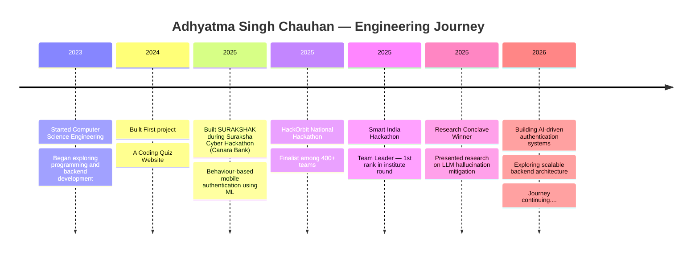

## About Me
- Computer Science Engineering student focused on **AI-driven and security-focused systems**
- Interested in **backend architecture, authentication systems, and intelligent automation**
- Experience building **AI verification platforms and behavioural security models**
- Active in **hackathons and research competitions**
- Currently exploring **system design and ML-based security solutions**
- Open To collaborations.
  
## Featured Projects

## Tech Stack

## Engineering Journey

## GitHub Analytics

## Contribution Activity

## Connect With Me

Let's connect and collaborate on AI, backend systems, and security projects.

&nbsp;&nbsp;&nbsp;

&nbsp;&nbsp;&nbsp;

&nbsp;&nbsp;&nbsp;

